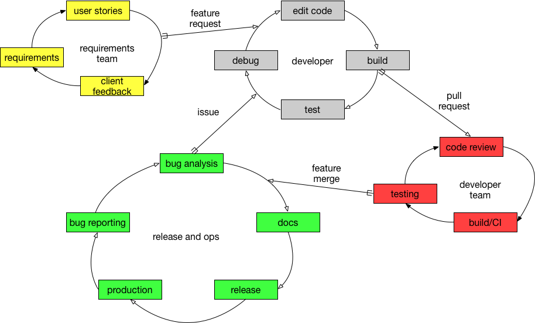

# What is Software Analytics?

{width=70%}

Modern software development can be seen as a process comprising many smaller,
looping, isolated processes. Each loop is triggered by an _input_ and produces
_output_ that triggers other processes. Moreover, each process has a different
_granularity level_, while processes are can be distributed within teams or even
among members of various teams.  The developers may

* Software production begins with new feature requests, developed in
  co-operation with the application clients/stakeholders. In agile environments,
  a requirements team will developer and iterate over _user stories_, which
  are then transformed into _feature requests_ that developers have to
  work on.

* A _developer_ loop is what we typically associate with software development.
  In response to a feature request, a single developer _edits code_ to satisfy
  the requirements, builds it on his local workstation (if necessary), _tests_
  it either automatically or manually and then creates a _changeset_ in the form
  of a _pull request_ or a patch to be integrated with the project mainline.

* Within the context of a _developer team_, developers _review_
  and/or _test_ each other's changesets. They are assisted in this process
  by Continuous Integration, testing infrastructures and other automated
  or semi-automated tools. Changes might be requested by the originating
  developer. The end result of this loop is a _feature merge_ to the
  project's mainline development.

* Then, the _release team_ takes over. Given an incoming feature, they
  will update the _documentation_ and they will release the software (i.e.,
  produce a new software version and store it as an immutable artifact).
  In places where _devops_ is practiced, the released version will be deployed
  in production. After a released version is produced, the maintenance
  phase begins: incoming bugs are received and after initial analysis are
  triaged and forwarded to developers for fixing.

Modern software teams use a variety of tools to accomplish these tasks:

* Version control systems (such as Git) are the heart of the collaboration
  infrastructure of modern software projects. Not only do they store the
  software code, they also act as triggers to all

* Issue management tools (such as Jira and GitHub issues) not only keep
  bug reports and new feature requests, but they are increasingly used
  as project planning infrastructure (e.g., for backlog management) and
  for soliciting user feedback on new planned features.

* Continuous Integration serves the dual role of both executing software tests
  and, in many cases, triggering the deployment of the built artifacts on
  testing or production environments.

* Various teams use custom tools to statically analyze code (e.g., Fortify),
  assist them with code review (e.g., Gerrit) and communication (e.g., Slack)

* Infrastructure as code tools (like Puppet and Ansible) automate the creation
  of deployment environments.

* After deployment into production, tools, like the ELK stack, store application
  runtime logs, while application stores store user reviews.

All those tools maintain records of developer activity in all stages of
development. This information can be extracted, analyzed and linked across tools
and across projects. The results of the analysis can be used to identify process
bottlenecks, to train models that assist developers in their workflows and to
help software teams make data-driven decisions.

Within this context, various works have attempted to define what software
analytics are. A selection of definitions can be seen in the table below.

|Ref  |Who?  | Definition                                                    |
|:---:|:----:|---------------------------------------------------------------|
| [@Hassa10] | Hassan  | [Software Intelligence] offers software practitioners (not just developers) up-to-date and pertinent information to support their daily decision-making processes. |
| [@Buse10] | Buse | The idea of analytics is to leverage potentially large amounts of data into real and actionable insights. |
| [@Zhang11] | Zhang | Software analytics is to enable software practitioners to perform data exploration and analysis in order to obtain insightful and actionable information for data-driven tasks around software and services. |
| [@Menzi13] | Menzies | Software analytics is analytics on software data for managers and software engineers with the aim of empowering software development individuals and teams to gain and share insight from their data to make better decisions.|

In our process- and feedback-centric view:

> *The overarching goal of _software analytics_ is to exploit the wealth of
information in software repositories to optimize production, delivery and
runtime operation of software.*
